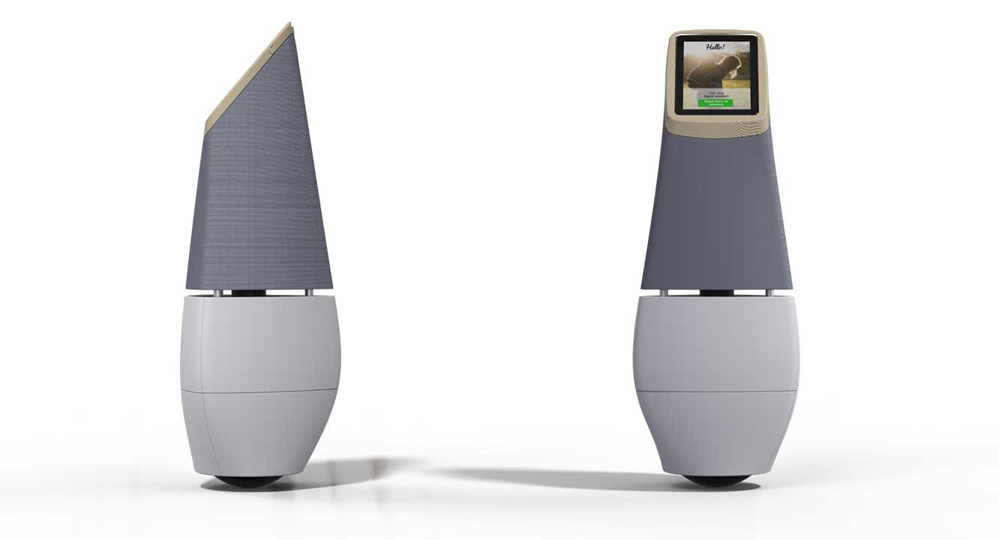
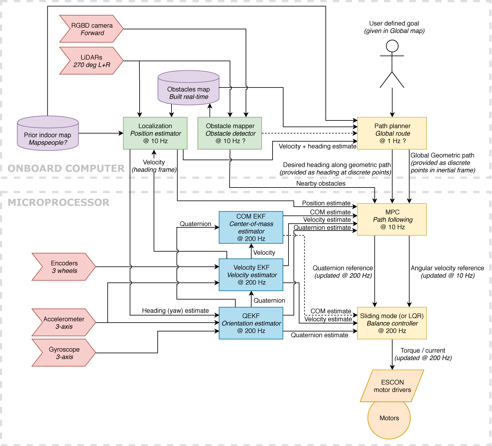
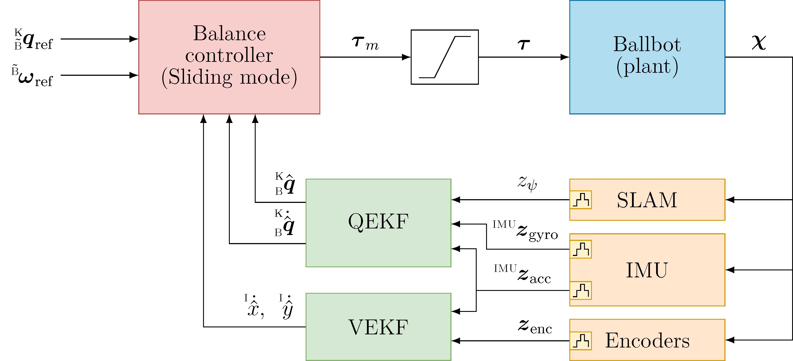
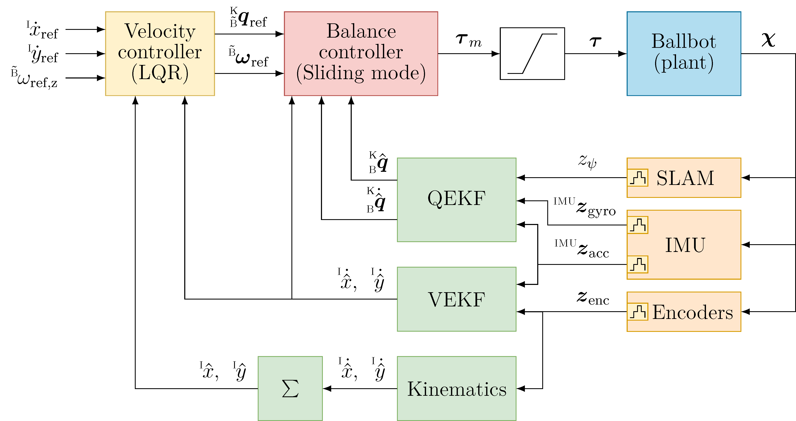
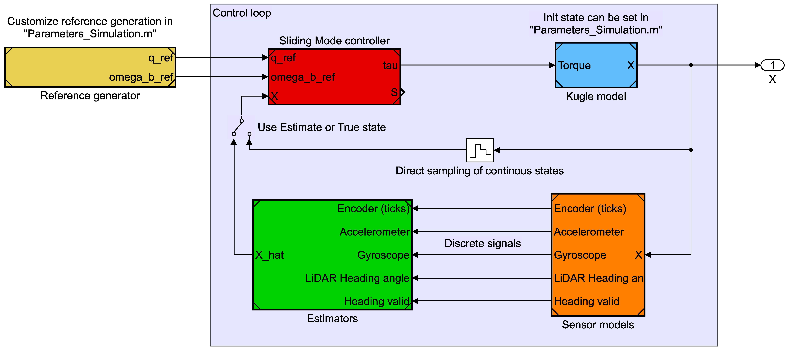
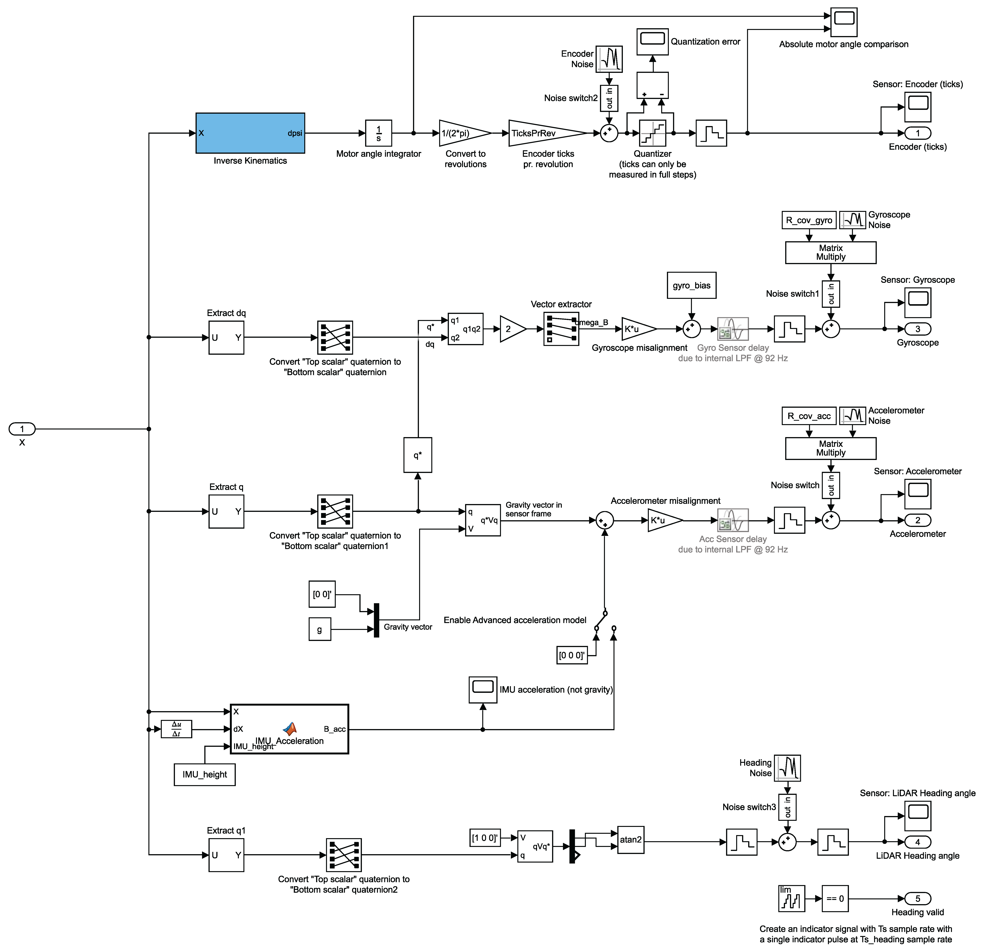
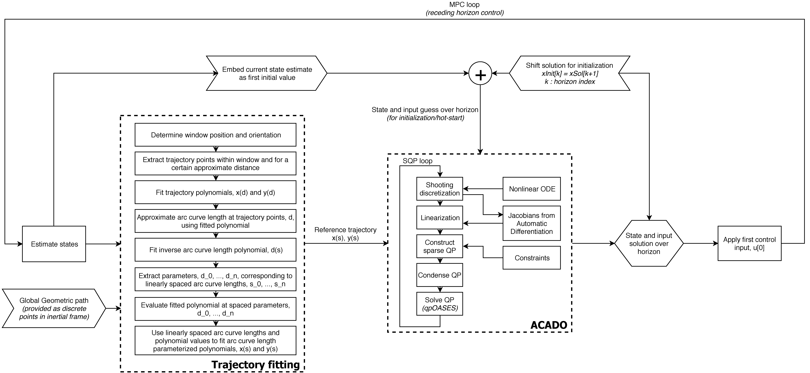

# Kugle - Modelling and Control of a Ball-balancing 
This repository is the main repository for master thesis work on the Kugle robot described in the thesis at [Kugle - Modelling and Control of a Ball-balancing Robot.pdf](Kugle%20-%20Modelling%20and%20Control%20of%20a%20Ball-balancing%20Robot.pdf).

&nbsp;&nbsp;&nbsp;&nbsp;

## Abstract
This thesis covers the derivation of a non-linear model and sliding mode controller for a ball-balancing robot with three omniwheels.
A quaternion-based model is derived using Lagrangian mechanics, with the quaternion and ball position as the generalized coordinates. The quaternion unit norm constraint is enforced with a Lagrange multiplier.
The quaternion model is used for sliding mode controller design of an orientation stabilizing controller that considers a quaternion error function based on the desired quaternion and angular velocity reference. Two sliding surfaces are proposed and compared in simulation.
The derived controller is verified in both simulation and in practice, using a 16 kg ballbot prototype, Kugle V1.
The controller and the necessary estimators, two extended Kalman filters for quaternion and velocity estimation, are implemented in an embedded firmware.
Continuously changing references can be tracked with a tracking error of less than 1 degree up to 1 Hz.
The controller is furthermore tested in a cascaded configuration with first a velocity LQR controller and subsequently a shape-accelerated path-following MPC, which generate quaternion and angular velocity references and enable station-keeping, velocity tracking and path-following. Velocity references up to 1 m/s and 1 rad/s are tested and confirmed trackable in practice.
The thesis concludes that it is indeed possible to derive and use a quaternion model for ballbot control even though it complicates the derivation and is deemed unnecessary due to the operating envelope.
All material, including the MATLAB code, simulations, ROS drivers and the embedded firmware, is open source and available on GitHub.

## Repository list
The thesis is written in the hope that it can serve as a reference for future students and researchers working on ball-balancing robots. All code from the work has been published, including MATLAB files, Simulink models, Embedded firmware, Gazebo simulation and ROS drivers. The code is publicly available and released under the MIT License on the following GitHub repositories:
 - [`Kugle-MATLAB`](https://github.com/mindThomas/Kugle-MATLAB) MATLAB code and Simulink models of the model and controller development, including the non-linear Quaternion model, Sliding mode balance controller and ACADO MPC for path following.
 - [`Kugle-Embedded`](https://github.com/mindThomas/Kugle-Embedded) Embedded firmware (C++) for the STM32H7 board used on the Kugle V1 prototype, running FreeRTOS enabling balance and velocity control with a Sliding mode controller, LQR and several EKF's while simultaneously communicating with the onboard computer with the ROS driver.
 - [`Kugle-ROS`](https://github.com/mindThomas/Kugle-ROS) ROS driver and ROS launch files.
 - [`Kugle-Gazebo`](https://github.com/mindThomas/Kugle-Gazebo) Gazebo simulation environment of the high-level navigational properties of the Kugle robot, including sensor layout and the shape-accelerated property (tilt-based acceleration).
 - [`Kugle-Misc`](https://github.com/mindThomas/Kugle-Misc) Code, libraries and other tools built for the Kugle robot project which do not fit in the other repositories, e.g., test code. Includes also a visual test-bench for the ACADO-generated Path-following MPC doing obstacle avoidance.

## Videoes
Videoes from the 8 month development period including simulations and tests, showing the on-going development ordered in time, can be found at the following [YouTube playlist](https://www.youtube.com/playlist?list=PLLtE4m3fKcOC_TuErjgOpTiI3abHPWM0x).

# Kugle-MATLAB
This repository contains the MATLAB code and Simulink models for the Kugle robot.
The MATLAB code includes the model, controller and estimator derivation scripts as derived in the thesis including a non-linear Quaternion model, Sliding mode attitude controller and ACADO MPC for path following. The Simulink models includes simulations of the non-linear model, the derived sliding mode controller, sensor models and estimators. 

The repository is organized in a relative hierarchy with both the MATLAB scripts and Simulink models referring to eachother. Some of the MATLAB scripts generates symbolic functions or optimized MEX functions which are called by other scripts. Pre-generated files are already included in the repository, but depending on changes made in the MATLAB files it might be necessary to regenerate the files. This includes the non-linear model, kinematics and linearization.

## Parameters
Model parameters, controller gains, estimator settings, simulation parameters and test reference parameters can all be modified globally (used in both derivation scripts and simulations) with the files in [`Parameters`](Parameters).

## Notes related to the report
When comparing this MATLAB code to the report, please note that the quaternion elements have been numbered from q1 to q4 instead of q0 to q3 as was done in the report.
This is to align the element with the indexing used by MATLAB, where the first element is at index 1.

# Required toolboxes
- Symbolic Toolbox
- Robotics System Toolbox    (used for `eul2quat` etc.)
- Simulink

## Other necessary MATLAB libraries
Peter Corkes Robotics Toolbox: http://petercorke.com/wordpress/toolboxes/robotics-toolbox

# System architecture
The proposed system architecture diagram of the an autonomous ball-balancing robot is shown below.

The diagram separates into two parts, based on the tasks suitable for the microprocessor and the onboard computer. Real-time critical tasks, such as the sliding mode balance controller and the estimators needed for this controller, is put in the <strong>microprocessor</strong>. Higher-level navigational tasks, such as path-planning and obstacle avoidance are put into the <strong>on-board computer</strong>.  

The estimates needed for the balance controller includes an orientation estimate from a Quaternion Extended Kalman Filter (QEKF), using the IMU measurements, and a velocity estimate provided by the Velocity Extended Kalman Filter (VEKF).

The ballbot is a shape-accelerated robot which means that the robot will accelerate when the inclination is non-zero. However, the definition of zero inclination is relative to the location of the center of mass and not to the orientation estimate itself.
The ballbot is stable whenever the center of mass is right above the center of the ball. However, if a misalignment between the expected center of mass, the orientation estimate and the actual center of mass is present, the ballbot will accelerate, even though the reference to the balance controller is set to upright.

To deal with this kind of alignment issue an initial calibration between the center of mass and orientation estimation frame, can be carried out. However, since both the orientation and acceleration is observable with the available sensors, a center of mass estimator can be developed to estimate the misalignment. Finally, the alignment issue can also be dealt with by including an integral term in a velocity or path following controller, as it is done with the velocity LQR controller.

Being able to balance is one thing, but to move the ballbot around it has been decided to use a model predictive controller, MPC, which is designed as a path-following controller. Preferably the MPC should be placed in the microprocessor to ensure real-time execution, however, due to a smaller bandwidth requirement and closed-loop stability of the balance controller, the MPC can also be offloaded to the onboard computer.  

The MPC controls the position of the ballbot and will thus need an estimate of the current location. This estimate can be computed based on pure localization using the LiDAR sensors and an existing map of the environment, or real-time multimodal SLAM combining both the LiDAR sensors and RGBD camera(s).

The scope of the thesis was to derive a sliding mode controller for balance control and a model predictive controller for path following. Furthermore the thesis included the estimator design of a quaternion estimator, the QEKF, and a velocity estimator, the VEKF. 
[ROS](https://www.ros.org/), the Robotic Operating System, is installed and used on the onboard computer. ROS provides a large set of preinstalled libraries, tools and especially message passing capabilities, enabling quick prototyping without having to reinvent the wheel. AMCL is used for localization while the [global path planner](http://wiki.ros.org/global_planner) of [’move_base’](http://wiki.ros.org/move_base) is used for path planning and navigation and extended with the MPC. The embedded microprocessor communicates with the onboard computer over USB and is linked to the ROS infrastructure with a custom ROS driver that has been developed in [Kugle-ROS](https://github.com/mindThomas/Kugle-ROS).

# Controller structure
### Balance controller loop
The purpose of the balance controller is to set the torque output to the three motors driving the omniwheels, so that the ballbot is kept balanced.

The controller takes in a desired quaternion reference and an angular velocity reference, to be used as feed-forward to reduce lag and improve reference tracking. The controller is designed as a non-linear sliding mode controller utilizing a complete coupled non-linear model of the ballbot. Estimates of the states in the state vector, including the quaternion, quaternion derivative and velocity estimate, is provided by corresponding Extended Kalman filters at the same rate as the controller.

### Velocity controller loop
Even though the balance controller is supposed to be used with the MPC as illustrated in the [System architecture](#system-architecture), a velocity LQR controller is derived to stabilize the otherwise unstable translational dynamics during testing, due to external disturbances and misalignment in the center of mass.

The velocity controller provides the same references to the balance controller as the MPC, namely the quaternion and angular velocity reference, while relying on velocity and position estimates from the VEKF and numerically integrated kinematics. The velocity controller runs at the same sample
rate as the balance controller and estimators, thus 200 Hz.

# Simulink simulation
The Simulink model is built as a hierarchy of several referenced models. This enables changes to be tracked across different type of simulations.
Five top-level simulations are located in [`Simulation`](Simulation) including simulation of the [Sliding mode balance controller](Simulation/KugleSim_SlidingMode.slx), the [LQR balance controller](Simulation/KugleSim_LQR.slx), the [velocity LQR controller](Simulation/KugleSim_VelocityLQR.slx) and the [path-following MPC](Simulation/MPC_Simulation.slx) and the [cascaded closed-loop simulation](Simulation/KugleSim_MPC.slx) with the MPC combined with the Sliding mode balance controller.
The individual models being referenced to within each top-level simulation are located in the [`Simulation/subsystems`](Simulation/subsystems) folder.
All blocks are programmed to automatically load a set of parameters from [`Parameters`](Parameters) before running the simulation. This enables easy adjustment of simulation parameters without having to dig into specific blocks. As an example the sliding mode controller gains, epsilon-tube and the sliding surface can be changed through in the parameters.

A few screenshots from the Simulink models are shown below.

### Top-level Simulink design
  
Note how the top-level model shown above follows the same structure as the balance controller loop shown above.

### Sensor models
  
The [sensor models](Simulation/subsystems/SensorModels.slx) are implemented according to the estimator descriptions in the thesis, and the output is a discrete signal sampled at the sample rate of 200 Hz. The simulation supports sensor and process noise to be added. Furthermore, the accelerometer bias and gyroscope bias are set to zero during simulation.

### Estimators
  
The estimators includes the [QEKF](Simulation/subsystems/QEKF_.slx) for quaternion and quaternion derivative estimation, and the [VEKF](Simulation/subsystems/VEKF.slx) for velocity estimation. Furthermore, the estimators include a numerical integration of the kinematics as the position estimate.

## Simulink parameters
All simulations are configured with the following Simulink solver settings. Please note that MATLAB 2018a has been used, but later versions are expected to be compatible as well.
 - Solver type: Variable-step
 - Solver: auto
 - Max step size: 10e-2
 - Relative tolerance: 10e-5
 - Min step size: auto
 - Absolute tolerance: auto

# Model Predictive Controller
A path-following MPC has been derived using the [ACADO](http://acado.github.io/) toolbox.

## MPC Loop
The ACADO MPC is derived with the MATLAB scripts in [`Controllers/MPC`](Controllers/MPC) the path-following MPC whose loop is illustrated below.

## Code generation and requirements
To generate the C++ code for the MPC, [ACADO](http://acado.github.io/) is used.

The code are generated using the MATLAB interface, so ACADO needs to be installed and configured for use with MATLAB: http://acado.github.io/matlab_overview.html

The generated C++ code for the MPC is both used in the MPC simulation at [Kugle-Misc](https://github.com/mindThomas/Kugle-Misc/tree/master/src/MPC_Test), in the MPC ROS package at [Kugle-ROS](https://github.com/mindThomas/Kugle-ROS/tree/master/kugle_mpc), and it is compiled into a MEX file to be used in closed-loop Simulink simulations and other MATLAB simulations.

## MPC simulation videos
A few videos from simulation of the generated ACADO MPC in MATLAB is listed below.

**Trajectory tracking - First MPC test with ACADO in MATLAB**  

**Path following - First MPC test with ACADO in MATLAB**  

**MPC initial window approach**  

**MPC Simulation in MATLAB with Figure Eight pattern**  

**MPC Simulation in MATLAB with Obstacle avoidance**  
